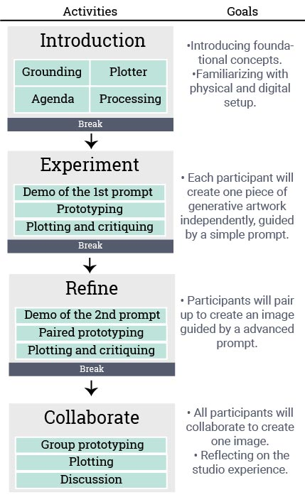

---

layout: page
title: Planned Activities
---

# Schedule & Planned Activities

This half-day workshop is intended as an introduction to creative coding, generative art and using plotters. The style of the studio will models an introduction to coding and generative art for non-CS majors.

Although participation is virtual, this studio is fully interactive. Our planned activities include:
 - Introduction, History & Foundation of Generative Art using Plotters
 - Brief intro on basic Python & our custom plotter library
 - Three interactive collaborative creative coding experiments
 - Livestreamed view of plotters translating participant's code into art!

The goal of the workshop is for participants to come away with a model of how to introduce plotters into their educational contexts, hands-on practice with creating generative art with other people and machines, and a unique souvenir of your plotter art! After the workshop, we will mail postcards of our art pieces to all participants, and the written code will be posted to Github for participants to access later.  

Studio size: Max 10 participants
How to apply
