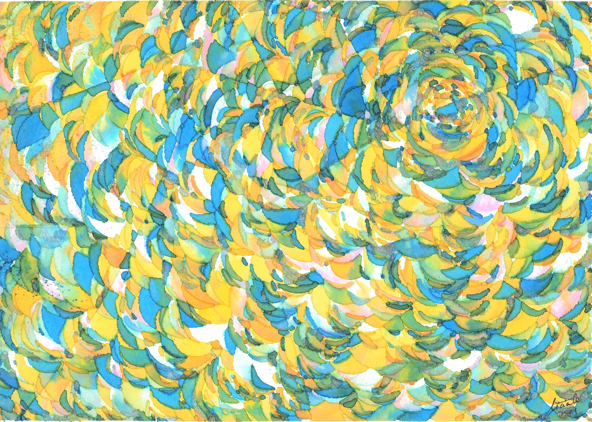
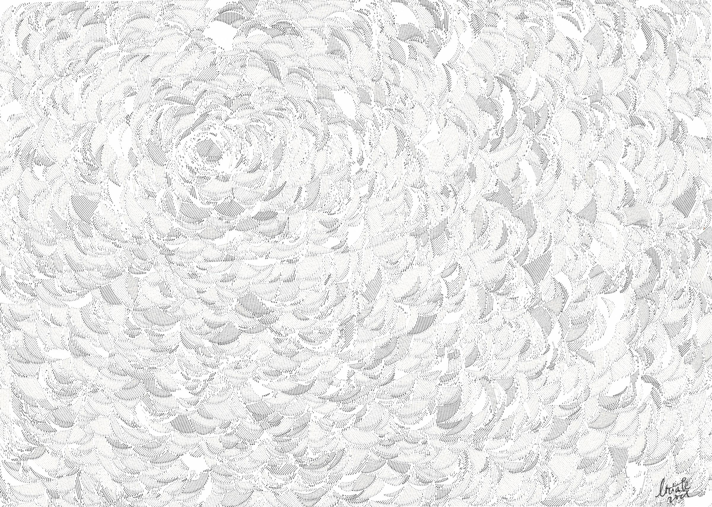
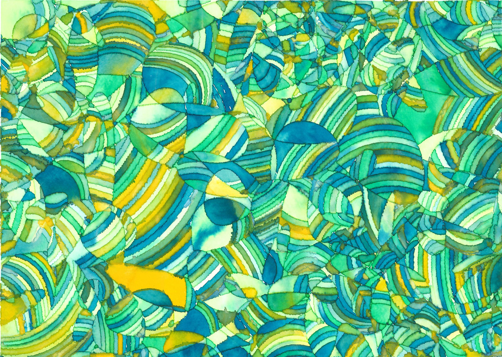
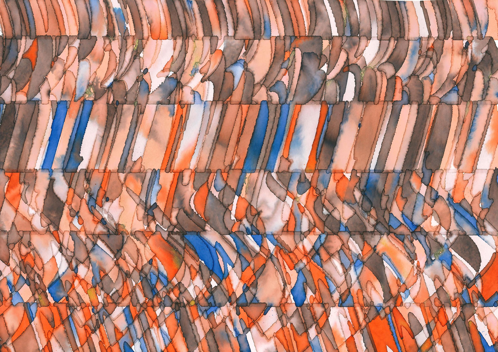

---

layout: home
title: About
---

# Collaborative Creative Coding Through Drawing Robots

With the development of end-user fabrication technology, plotters have become increasingly accessible and attractive to a broader community. Since their invention, these 3-axis CNC machines have been connecting digital and analog creation. Plotters have great potential as a tool to bridge the digital-physical divide, allowing learners from a variety of backgrounds to gain immediate satisfaction from their programming by translating digital output into physical artifacts. In addition, due to their roots in art, plotters may be more inviting to students from artistic backgrounds new to programming.

In this studio, we investigate plotters' potential in introducing creative programming in collaborative learning environments. By introducing collaborative creative programming through the lens of plotters, we explore solutions to challenges in programming education, collaborative programming, and personal fabrication.

**Studio Organizers**
-   [Shiqing He](mailto:liciahe@tamu.edu), Department of Visualization, Texas A&M University, College Station, Texas, United States
-   [Jasmine Jones](https://jazzij.github.io), Computer Science, Berea College, Berea, Kentucky, United States

**Half day studio**, Sunday, Feb 13

**Studio Time:**  2022-2-13 (Sunday)  [UCT 14:00-18:00](https://www.timeanddate.com/worldclock/converter.html?iso=20220213T140000&p1=2284&p2=224&p3=235&p4=179)
	- 6:00-10:00 am in PT (e.g., San Francisco)
	- 8:00am- 12:00pm  CST (e.g., Chicago)
	- 9:00am-1:00 pm EST (e.g., New York)
	- 11:00 pm - 3:00 am KST (Seoul) 

**Studio Registration Fee:** US$30 (payable via [TEI'22 registration system](https://tei.acm.org/2022/attend/registration/))
**Studio Material Fee:** US$15 (payable via [TEI'22 registration system](https://tei.acm.org/2022/attend/registration/))
**Studio size**: Max 10 participants

**Timeline:**  
- Application closes on  **1/31/2022 (anywhere on earth)**.
- Participants notified by **2/4/2022**
- Studio happens on **2/13/2022**

||
|:--:|
| <b><i>Left:</i> plotters are accessible CNC machines that guide various tools (e.g., pen, pencil, and brush) along vector paths. <i>Right:</i> examples of plotter-made paintings that are created from one algorithm. Original artwork by Shiqing He.</b> |

---------------------------------------

#### More plotter examples:
(Original artwork by [Shiqing Licia He](https://twitter.com/Licia_He))

